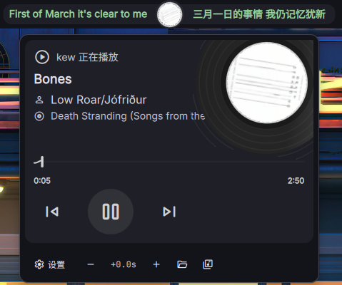

# LyricsEmbed

> 一款以 **内嵌歌词** 为核心的同步歌词插件，基于 [xubuyuan18/dms-plugin-Lyrics](https://github.com/xubuyuan18/dms-plugin-Lyrics) 二次开发，上游原作者为 [gasiyu/dms-plugin-musiclyrics](https://github.com/gasiyu/dms-plugin-musiclyrics)。

**中文** | [English](README_EN.md)


## ✨ 特性

### 🎵 内嵌歌词优先
- 从音乐文件元数据的 `LYRICS`/`USLT` 标签中提取 LRC 歌词，导入本地缓存
- 已缓存歌曲增量跳过，**不覆盖手动校准的歌词偏移**
- 音乐库路径可自定义（默认 `$HOME/Music`）

### 🔄 多源歌词
- 自定义 API → 本地缓存 → 网易云音乐 → lrclib.net
- 支持变量 `{title}`、`{artist}`、`{album}`

### 🌐 双语歌词
- `原文|翻译`：同时间戳两行拼接为一行
- `仅原文` / `仅翻译`：自动识别原文和翻译
- 居中分栏模式：封面左侧原文、右侧翻译

### 🎚️ 歌词偏移微调
- 工具栏 `-` / `+` 按钮逐 0.1s 校准
- 偏移保存到单曲缓存，下次播放自动恢复

### 🎸 其他
- 黑胶唱片旋转封面弹窗、播放控制、MPRIS 实时同步
- 屏蔽词过滤、播放器白名单、未播放时世界时钟
- 火狐浏览器视频 / MV 自动识别

## 📸 截图



## 📦 安装

```bash
cd ~/.config/DankMaterialShell/plugins
git clone https://github.com/Lemon-mon-254/dms-plugin-Lyrics.git LyricsEmbed
dms ipc call plugins reload lyrics
```

> 若 `dms ipc plugins reload` 无效，重启 DankMaterialShell 使插件生效。

依赖 `ffprobe`（ffmpeg 套件），用于内嵌歌词提取：

```bash
sudo pacman -S ffmpeg
```

## 📁 项目结构

```
LyricsEmbed/
├── Lyrics.qml                    # 主组件：歌词获取、UI、播放控制、偏移微调
├── LyricsSettings.qml            # 设置界面
├── import-embedded-lyrics.sh     # 内嵌歌词导入脚本（扫描按钮调用）
├── plugin.json                   # 插件配置
├── docs/
│   └── screenshot.png            # 插件截图
├── README.md
└── LICENSE
```

## ⚙️ 配置

| 类别 | 选项 | 说明 |
|------|------|------|
| 显示 | 封面位置 | 靠左 / 靠右 / 居中分栏（左右双语） |
| 显示 | 歌词翻译 | `原文\|翻译` / `仅原文` / `仅翻译` |
| 显示 | 超长歌词截断 | 用省略号截断超长行 |
| 显示 | 封面自动旋转 | 状态栏封面是否播放时旋转 |
| 显示 | 未播放时显示时钟 | 空闲时显示当前时间 |
| 显示 | 世界时钟时区 | 弹窗时区列表（名称:UTC偏移量，逗号分隔） |
| 显示 | 屏蔽词 | 歌词行包含任一关键词则不显示 |
| 显示 | 播放器白名单 | 仅检测指定播放器，留空则全部 |
| 缓存 | 音乐库路径 | 扫描内嵌歌词的音乐库目录（默认 `$HOME/Music`） |
| 缓存 | 本地缓存 | 启用磁盘缓存，加速加载 |
| 内置源 | 网易云音乐 | 中文歌曲优先 |
| 内置源 | lrclib.net | 开源歌词库，后备源 |
| 自定义 API | 地址/方法 | 支持变量 `{title}`, `{artist}`, `{album}` |

**获取优先级**: 自定义 API → 本地缓存 → 网易云音乐 → lrclib.net

### 自定义 API 配置

- **URL 格式**: `https://api.example.com/lyrics?title={title}&artist={artist}&album={album}`
- **请求方式**: GET 或 POST
- **响应格式**: `lyrics` / `lyric` / `lrc` / `content` / `data` 任一字段为 LRC 文本

**示例**:
```
https://lrclib.net/api/get?track_name={title}&artist_name={artist}
```

## 📝 使用说明

### 内嵌歌词导入
1. 设置页配置「音乐库路径」（默认 `$HOME/Music`）
2. 弹窗工具栏点击「导入缓存」，或设置页点击「导入内嵌歌词到缓存」
3. 已有缓存歌曲自动跳过，不覆盖手动校准的偏移

### 歌词偏移微调
1. 打开弹出面板，工具栏点 `-` / `+`（每步 0.1s）
2. 对齐后点保存按钮（💾），写入该歌曲缓存
3. 下次播放自动恢复，每首歌独立记忆

## 🧠 实现细节

### 歌词获取流程
1. 检测歌曲切换（MPRIS 事件）
2. 优先级获取：自定义 API → 缓存 → 网易云 → lrclib
3. 解析 LRC 格式，建立时间索引
4. 定时轮询播放位置，匹配当前歌词行

### 专辑匹配算法
```
1. 歌曲名完全匹配 + 专辑匹配
2. 歌曲名完全匹配（忽略大小写/空格）
3. 歌曲名模糊匹配 + 专辑匹配
4. 歌曲名模糊匹配（包含关系）
5. 默认返回第一首
```

### 缓存格式
- 路径: `~/.cache/Lyrics/`
- 文件名: `fnv1a32(title + "\0" + artist).json`
- 内容: `{lines, source, cachedAt, offset}`

### 纯音乐检测
自动过滤包含以下标记的歌词行：
- 纯音乐，请欣赏
- Instrumental
- 无歌词 / 暂无歌词

## 📜 致谢

- 原插件: [xubuyuan18/dms-plugin-Lyrics](https://github.com/xubuyuan18/dms-plugin-Lyrics)
- 上游项目: [gasiyu/dms-plugin-musiclyrics](https://github.com/gasiyu/dms-plugin-musiclyrics)

## 🔒 许可证

[MIT](./LICENSE)
